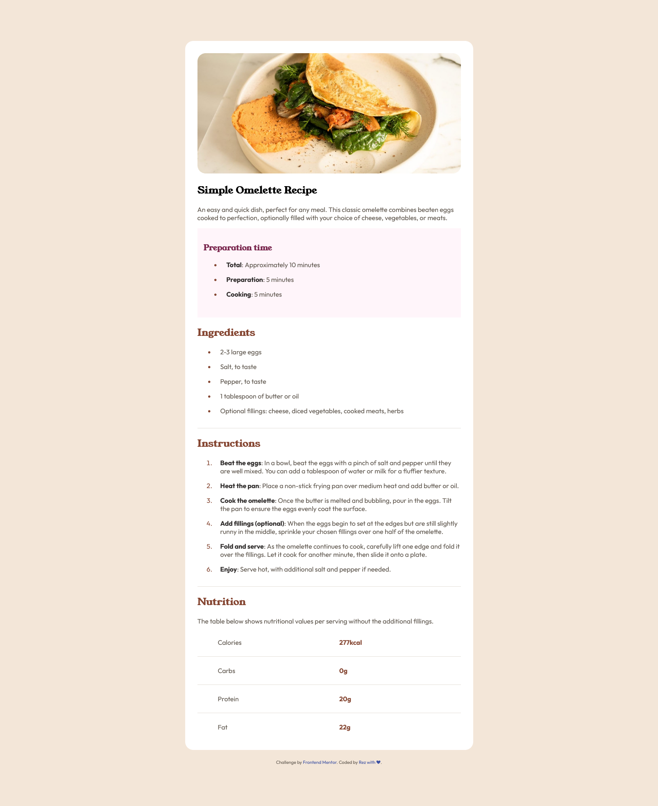
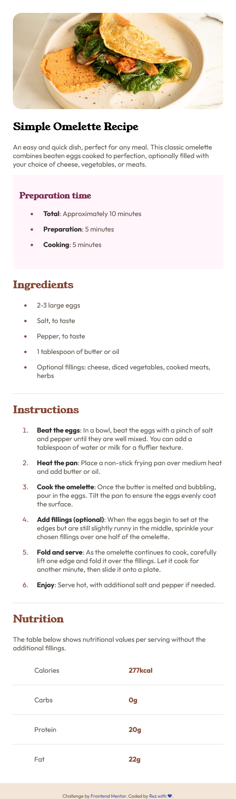

# Frontend Mentor - Recipe page solution

Site is live at 

## My process
  - I have Built this using HTML, CSS only
  - I learned how html element are responsive by default and we who make it unresponsive by writing bad css 🤣
  - Learned how to use css custom properties like variable for color
  - Resource - kevin powell youtube channel
  - built by Rez.

### Built with
- Semantic HTML5 markup.
- CSS custom properties.

#### 1 Issue still persist
- I dont know how to pop hero img out of the div in mobile view.If anyone can help 🙏